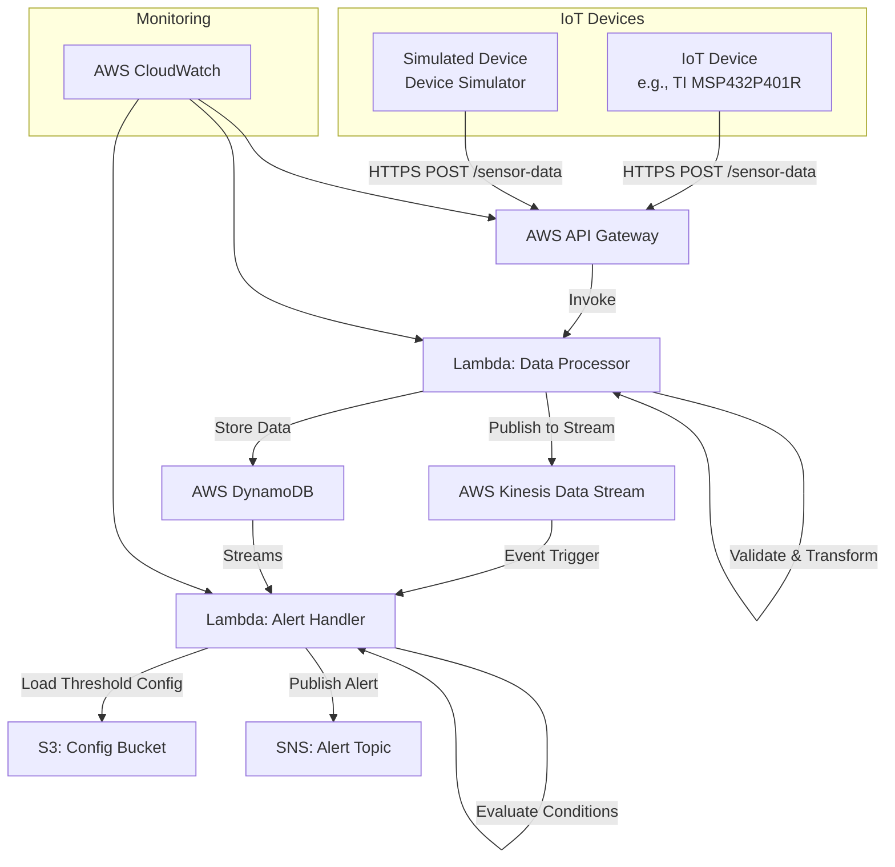

# IoT Sensor Data Collection & Analytics Platform

<div align="center">
  
</div>

---

[](LICENSE)
[](https://www.python.org/downloads/release/python-380/)
[](https://aws.amazon.com/)

---

## Table of Contents

- [Introduction](#introduction)
- [Architecture Overview](#architecture-overview)
  - [Key Components](#key-components)
  - [Architecture Diagram](#architecture-diagram)
- [Features](#features)
- [Supported Devices](#supported-devices)
- [Use Cases](#use-cases)
- [Technologies Used](#technologies-used)
- [Prerequisites](#prerequisites)
- [Getting Started](#getting-started)
  - [Clone the Repository](#clone-the-repository)
  - [Configure AWS Credentials](#configure-aws-credentials)
  - [Install Dependencies](#install-dependencies)
  - [Deploy Infrastructure](#deploy-infrastructure)
- [Directory Structure](#directory-structure)
- [Usage](#usage)
  - [Running the Device Simulator](#running-the-device-simulator)
  - [Integrating Real IoT Devices](#integrating-real-iot-devices)
  - [Monitoring Data Processing](#monitoring-data-processing)
  - [Accessing Stored Data](#accessing-stored-data)
  - [Viewing Logs and Alerts](#viewing-logs-and-alerts)
- [Configuration](#configuration)
- [Data Schema](#data-schema)
- [Cleanup](#cleanup)
- [Contributing](#contributing)
- [License](#license)
- [Acknowledgments](#acknowledgments)
- [Support](#support)
- [Frequently Asked Questions (FAQ)](#frequently-asked-questions-faq)

---

## Introduction

**Note**: For detailed business strategies, supply chain logistics, and operational workflows related to this platform, please refer to the comprehensive business plan document available in the `docs/` directory: [Business Plan](docs/business.md). This document outlines in-depth technical specifications, manufacturing processes, and deployment strategies.

The **IoT Sensor Data Collection & Analytics Platform** is a comprehensive, scalable, and serverless solution designed to collect, process, and analyze real-time data from a wide range of IoT devices. Leveraging advanced AWS services and adhering to best practices in cloud architecture, this platform provides end-to-end capabilities for integrating various sensors that capture environmental and device metrics, such as:

- Temperature
- Humidity
- Air Quality Index (AQI)
- Light Intensity
- Sound Levels
- GPS Location
- Pressure
- CO₂ Levels
- UV Index
- Wind Speed and Direction
- Battery Level
- Signal Strength
- Motion Detection

**Key Benefits:**

- **Real-Time Data Ingestion and Processing**: High-throughput data ingestion through AWS API Gateway and Lambda functions, ensuring minimal latency.
- **Event-Driven Alerts Based on Custom Thresholds**: Configurable alerting mechanisms using AWS Lambda and SNS for immediate notifications.
- **Scalable Data Storage and Archiving**: Utilization of AWS DynamoDB and S3 for storing time-series data with virtually unlimited scalability.
- **Comprehensive Monitoring and Logging**: Enhanced observability through AWS CloudWatch for tracking performance metrics and logging.
- **Secure and Resilient Architecture**: Implemented with security best practices, including IAM role management, encrypted data storage, and secure API endpoints.

This project follows microservices architecture and serverless computing principles, ensuring high availability, fault tolerance, and cost-effectiveness. It's ideal for applications in environmental monitoring, industrial IoT, smart cities, agriculture, and any domain requiring real-time insights from sensor data.

---

## Architecture Overview

The platform is built upon a microservices architecture utilizing AWS serverless components. The design ensures that each component is decoupled, scalable, and can be developed, deployed, and maintained independently.

### Key Components

- **IoT Devices**: Physical sensors or simulated devices that send sensor data via RESTful API calls over HTTPS. Devices implement secure communication protocols, support data encryption in transit, and handle authentication mechanisms as needed. Examples include:

  - **Microcontrollers**: Using devices like **Texas Instruments MSP432P401R** for low-power operations.
  - **Sensors**: Incorporating **Bosch BME280** for temperature, humidity, and pressure measurements.

- **AWS API Gateway**: Acts as a front door for applications to access data from IoT devices. It provides features like request validation, throttling, and API key management.

- **AWS Lambda Functions**: Serverless compute services that run code without provisioning or managing servers.

  - **Data Processor Function**: Handles input validation, data transformation, enrichment, and persistence. Ensures that incoming data conforms to the expected schema and enriches data with metadata if necessary.
  - **Alert Handler Function**: Consumes data from DynamoDB Streams or Kinesis Data Streams, evaluates sensor readings against configurable thresholds, and triggers alerts via SNS when conditions are met.

- **AWS DynamoDB**: A fast and flexible NoSQL database service for applications that need consistent, single-digit millisecond latency at any scale. It stores time-series sensor data, providing high availability and durability.

- **AWS Kinesis Data Streams**: Enables real-time processing of streaming data at massive scale. Facilitates decoupling between the data ingestion layer and downstream processing components.

- **AWS SNS (Simple Notification Service)**: Allows applications to send time-critical messages to multiple subscribers through a "publish-subscribe" mechanism.

- **AWS S3 (Simple Storage Service)**: Used for storing configuration files, such as threshold settings for alerts, and serves as a durable storage solution for data archiving and backups.

- **AWS CloudWatch**: Provides a unified view of operational health and resource utilization. Collects and tracks metrics, collects and monitors log files, sets alarms, and automatically reacts to changes in AWS resources.

- **AWS CloudFormation**: Allows for infrastructure as code (IaC), enabling automation and reproducibility.

### Architecture Diagram



**Explanation**:

- **Data Ingestion**: IoT Devices send data to the API Gateway endpoint using HTTPS POST requests.
- **Data Processing**: The API Gateway triggers the Data Processor Lambda function, which processes incoming data, including validation and transformation.
- **Data Persistence**: Validated data is stored in DynamoDB.
- **Data Streaming**: The Data Processor function also publishes data to Kinesis Data Streams for real-time processing.
- **Alerting Mechanism**: The Alert Handler Lambda function evaluates incoming data against thresholds and publishes alerts via SNS.
- **Monitoring and Logging**: AWS CloudWatch collects logs and metrics from the Lambda functions and API Gateway.

---

## Features

- **Real-Time Data Processing**: Capable of handling high volumes of data in real-time, ensuring immediate processing and storage.
- **Scalable Architecture**: Designed to scale horizontally with the number of devices and data throughput, leveraging AWS auto-scaling features and serverless services.
- **Configurable Alerting Mechanism**: Thresholds and alert criteria can be adjusted dynamically without code changes, by updating configurations stored securely in S3.
- **Secure Communication**: All data transmissions are secured over HTTPS using TLS encryption, and AWS services are configured with strict IAM policies following the principle of least privilege.
- **Extensible Data Schema**: Supports a wide range of sensor data, and the schema can be extended to incorporate additional metrics as needed.
- **Infrastructure as Code**: Complete environment setup and teardown are managed via AWS CloudFormation templates and deployment scripts.
- **High Availability and Fault Tolerance**: Leveraging AWS managed services ensures that the platform is highly available and resilient to failures.
- **Comprehensive Monitoring and Logging**: Enhanced observability through AWS CloudWatch for tracking performance metrics and logging.

---

## Supported Devices

The platform is designed with flexibility in mind, allowing integration with various types of IoT devices and sensors, including but not limited to:

- **Temperature Sensors**: Devices like **Sensirion SHT31** or **Bosch BME280**.
- **Humidity Sensors**: For measuring relative humidity levels.
- **Air Quality Sensors**: Such as **Sharp GP2Y1010AU0F** for particulate matter.
- **Light Intensity Sensors**: Using **Vishay VEML7700** ambient light sensors.
- **Sound Level Meters**: Sensors like **Adafruit MAX4466** for ambient noise levels.
- **Barometric Pressure Sensors**: **Bosch BMP388** for atmospheric pressure.
- **GPS Modules**: **u-blox NEO-M8N** for geolocation capabilities.
- **Motion Detectors**: **InvenSense MPU-6050** for movement detection.
- **Custom Devices**: Any IoT device that can communicate over HTTPS and adhere to the specified data schema.

---

## Use Cases

- **Environmental Monitoring**: Real-time monitoring in laboratories, data centers, or natural reserves.
- **Industrial IoT**: Monitoring equipment health in manufacturing plants using vibration sensors like **PCB Piezotronics Model 603C01**.
- **Smart Cities**: Collecting data for urban planning, traffic management, and pollution control.
- **Agriculture and Farming**: Monitoring soil moisture and weather conditions with **Decagon 5TE** sensors.
- **Asset Tracking and Management**: Using GPS-enabled devices for logistics and supply chain operations.

---

## Technologies Used

- **Programming Languages**:

  - **Python 3.8**: Used for developing AWS Lambda functions and device firmware.

- **AWS Services**:

  - **API Gateway**: For creating and securing RESTful APIs.
  - **Lambda**: For serverless compute functions.
  - **DynamoDB**: For high-performance data storage.
  - **Kinesis Data Streams**: For real-time data streaming.
  - **SNS**: For sending notifications and alerts.
  - **S3**: For object storage, including configurations and logs.
  - **CloudWatch**: For monitoring AWS resources and applications.
  - **CloudFormation**: For infrastructure as code.

- **Other Tools**:

  - **AWS CLI**: For interacting with AWS services.
  - **Git**: For version control.
  - **MermaidJS**: For creating and visualizing architecture diagrams within Markdown documents.
  - **jq**: For processing JSON in shell scripts.

---

## Prerequisites

- **AWS Account**: An active AWS account with permissions to create and manage resources like Lambda functions, DynamoDB tables, etc.
- **AWS CLI**: Installed and configured with IAM credentials that have the necessary permissions.
- **Python 3.8**: Installed on your local machine along with `pip` for managing Python packages.
- **Git**: Installed for cloning the repository and contributing to the project.
- **jq**: Installed for processing JSON in shell scripts.
- **Mermaid Support**: Ensure your Markdown viewer or IDE supports MermaidJS rendering.

---

## Getting Started

### Clone the Repository

```bash
git clone https://github.com/yourusername/iot-sensor-platform.git
cd iot-sensor-platform
```

### Configure AWS Credentials

Ensure your AWS CLI is configured with credentials that have the necessary permissions.

```bash
aws configure
```

### Install Dependencies

Install the required Python packages using `pip`.

```bash
pip install -r requirements.txt
```

### Deploy Infrastructure

Use the provided deployment script to set up AWS resources via CloudFormation.

```bash
cd scripts
chmod +x deploy.sh
./deploy.sh
```

**Deployment Process Details**:

- **Package Lambda Functions**: The script packages Lambda functions using AWS CloudFormation package commands.
- **Upload to S3**: Lambda deployment packages are uploaded to an S3 bucket.
- **Deploy CloudFormation Stack**: Creates AWS resources including API Gateway, Lambda functions, DynamoDB tables, Kinesis streams, SNS topics, and IAM roles.
- **Output Endpoint URL**: The script outputs the API Gateway endpoint URL for use with IoT devices.

---

## Directory Structure

```plaintext
iot-sensor-platform/
├── README.md
├── LICENSE
├── .gitignore
├── requirements.txt
├── api/
│   └── api_definition.yaml
├── config/
│   └── config.json
├── docs/
│   ├── architecture_diagram.png
│   ├── business_plan.md
│   └── technical_specifications.md
├── infrastructure/
│   ├── template.yaml
│   └── parameters.json
├── scripts/
│   ├── deploy.sh
│   └── cleanup.sh
├── src/
│   ├── device_simulator.py
│   ├── lambda_functions/
│   │   ├── __init__.py
│   │   ├── alert_handler.py
│   │   ├── data_processor.py
│   │   └── utils.py
│   └── microcontroller_firmware/
│       ├── __init__.py
│       ├── main.py
│       ├── data_sampler.py
│       ├── calibration.py
│       ├── sensor_drivers.py
│       └── hardware_interface.py
├── .env.example
└── tests/
    └── test_functions.py
```

- **README.md**: Comprehensive documentation of the project.
- **LICENSE**: Licensing information.
- **requirements.txt**: Python dependencies.
- **api/**: Contains API definitions using OpenAPI Specification.
- **config/**: Configuration files, including threshold settings.
- **docs/**: Additional documentation and diagrams, including the **Business Plan**.
- **infrastructure/**: CloudFormation templates and parameters.
- **scripts/**: Deployment and cleanup scripts.
- **src/**: Source code for Lambda functions and device firmware.
- **tests/**: Unit and integration tests.

---

## Usage

### Running the Device Simulator

The device simulator emulates IoT devices for testing and development.

```bash
python src/device_simulator.py
```

**Configuration**:

- Set the `API_ENDPOINT` environment variable to the API Gateway endpoint.

```bash
export API_ENDPOINT="https://your-api-endpoint.amazonaws.com/prod"
```

- **Simulator Features**:

  - Simulates sensor data based on configurable parameters.
  - Sends data at specified intervals.
  - Logs responses and handles errors.

### Integrating Real IoT Devices

To integrate actual IoT devices:

1. **Prepare the Device**

   - Ensure it supports HTTPS requests and JSON parsing.
   - Configure network settings for internet access.

2. **Set API Endpoint**

   - Program the device to send HTTP POST requests to `/sensor-data`.

3. **Format Data Payload**

   - Structure the JSON payload according to the [Data Schema](#data-schema).
   - Use appropriate serialization for sensor data.

4. **Implement Error Handling and Retries**

   - Handle HTTP responses and implement retries with exponential backoff.

5. **Handle Authentication (Optional)**

   - Implement API keys or authentication tokens if required.

**Sample Code Snippet (Python)**:

```python
import json
import requests
import time
import ssl

API_ENDPOINT = "https://your-api-endpoint.amazonaws.com/prod/sensor-data"

data_payload = {
    "device_id": "device123",
    "timestamp": "2023-10-15T14:30:00Z",
    "temperature": 22.5,
    "humidity": 55.2,
    "pressure": 1013.25
}

headers = {
    "Content-Type": "application/json"
}

response = requests.post(API_ENDPOINT, data=json.dumps(data_payload), headers=headers, verify=True)

if response.status_code == 200:
    print("Data sent successfully")
else:
    print(f"Error: {response.status_code} - {response.text}")
```

### Monitoring Data Processing

Use AWS CloudWatch to monitor the system's health and performance:

- **Logs**:

  - Access logs for `data_processor` and `alert_handler` Lambda functions.
  - Analyze log streams for errors and performance metrics.

- **Metrics**:

  - Monitor key metrics like Lambda invocation counts, durations, error rates, and throttling.
  - Set up custom dashboards for real-time performance views.

- **Alarms**:

  - Configure CloudWatch Alarms to notify when thresholds are crossed.

### Accessing Stored Data

Retrieve sensor data stored in DynamoDB:

- **Via AWS Console**:

  - Navigate to **DynamoDB** > **Tables**.
  - Select the `SensorDataTable`.
  - Use the **Explore Table** feature.

- **Programmatically**:

  - Use AWS SDKs (Boto3 for Python) to access DynamoDB data.

**Sample Code Snippet (Python)**:

```python
import boto3
from boto3.dynamodb.conditions import Key

dynamodb = boto3.resource('dynamodb')
table = dynamodb.Table('SensorDataTable')

response = table.query(
    KeyConditionExpression=Key('device_id').eq('device123')
)

items = response['Items']
for item in items:
    print(item)
```

### Viewing Logs and Alerts

- **CloudWatch Logs**:

  - View detailed logs for troubleshooting and analysis.

- **SNS Subscriptions**:

  - Subscribe via email, SMS, or other protocols to receive real-time alerts.

---

## Configuration

Configuration files are stored in the `config/` directory and uploaded to the S3 Config Bucket during deployment.

- **config.json**: Contains threshold values and settings for the alert handler Lambda function.

**Example `config.json`**:

```json
{
    "temperature_threshold": 30,
    "humidity_threshold": 70,
    "aqi_threshold": 100,
    "co2_threshold": 1000,
    "noise_level_threshold": 85,
    "battery_level_threshold": 20,
    "pressure_threshold": 1020,
    "light_intensity_threshold": 800,
    "signal_strength_threshold": -70
}
```

**Updating Configurations**:

1. Modify the `config.json` file locally.
2. Upload the updated file to the S3 bucket.

```bash
aws s3 cp config/config.json s3://your-config-bucket/config.json
```

3. Ensure the Lambda function has permissions to access the S3 bucket.

---

## Data Schema

The platform expects data in a specific JSON format to ensure consistency and reliability.

**Data Schema Definition**:

```json
{
    "device_id": "string",
    "timestamp": "YYYY-MM-DDTHH:MM:SSZ",
    "temperature": float,
    "humidity": float,
    "air_quality_index": float,
    "light_intensity": float,
    "sound_level": float,
    "pressure": float,
    "co2_level": float,
    "uv_index": float,
    "wind_speed": float,
    "wind_direction": "string",
    "battery_level": float,
    "signal_strength": float,
    "latitude": float,
    "longitude": float,
    "orientation": "string",
    "motion_detected": boolean
}
```

**Key Points**:

- **Mandatory Fields**:

  - `device_id`: Unique identifier for the device.
  - `timestamp`: ISO 8601 format, e.g., `"2023-10-15T14:30:00Z"`.
  - At least one sensor reading.

- **Optional Fields**:

  - All other fields are optional but recommended where applicable.

- **Data Types**:

  - **Strings**: Enclosed in double quotes.
  - **Floats**: Decimal numbers without quotes.
  - **Booleans**: `true` or `false`.

**Data Validation**:

- The Data Processor Lambda function performs schema validation.
- Invalid data results in a validation error and is rejected.
- Errors are logged in CloudWatch for troubleshooting.

---

## Cleanup

To delete AWS resources and avoid ongoing charges, use the provided cleanup script.

```bash
cd scripts
chmod +x cleanup.sh
./cleanup.sh
```

**Cleanup Process Details**:

- Deletes the CloudFormation stack.
- Removes S3 buckets and their contents.
- Detaches and deletes IAM roles and policies.
- Cleans up Lambda functions and associated logs.

**Warning**: This action is irreversible. Ensure you have backups of any data or configurations you wish to keep before proceeding.

---

## Contributing

Contributions are welcome! Whether it's reporting a bug, suggesting new features, or submitting a pull request, your input is valuable.

**Guidelines**:

- **Fork the Repository**: Create a personal fork of the repository on GitHub.
- **Create a Feature Branch**: Use descriptive names, e.g., `feature/add-new-sensor-support`.
- **Submit a Pull Request**: Provide a clear description of your changes and the problem they solve.
- **Code Style**: Follow PEP 8 guidelines for Python code.
- **Testing**: Ensure your changes are thoroughly tested. Add unit tests in the `tests/` directory.

**Additional Resources**:

- [CONTRIBUTING.md](CONTRIBUTING.md): Detailed contribution guidelines.
- [CODE_OF_CONDUCT.md](CODE_OF_CONDUCT.md): Code of conduct for contributors.

---

## License

This project is licensed under the [MIT License](LICENSE).

---


