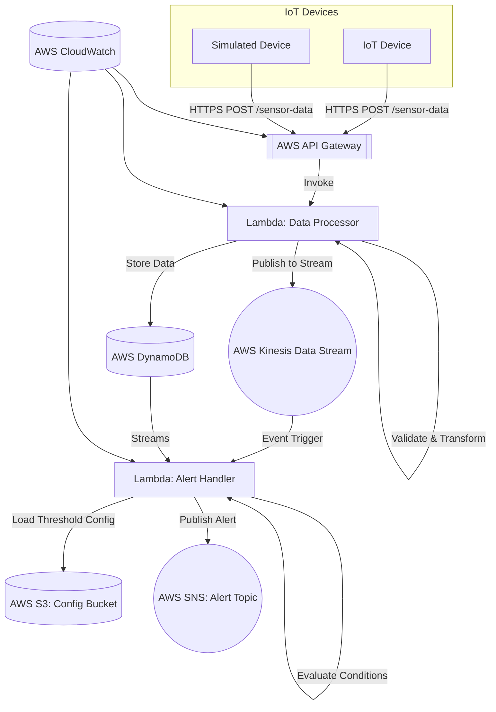

# IoT Sensor Data Collection & Analytics Platform

## Table of Contents

- [Introduction](#introduction)
- [Architecture Overview](#architecture-overview)
- [Features](#features)
- [Supported Devices](#supported-devices)
- [Use Cases](#use-cases)
- [Technologies Used](#technologies-used)
- [Prerequisites](#prerequisites)
- [Getting Started](#getting-started)
  - [Clone the Repository](#clone-the-repository)
  - [Configure AWS Credentials](#configure-aws-credentials)
  - [Install Dependencies](#install-dependencies)
  - [Deploy Infrastructure](#deploy-infrastructure)
- [Directory Structure](#directory-structure)
- [Usage](#usage)
  - [Running the Device Simulator](#running-the-device-simulator)
  - [Integrating Real IoT Devices](#integrating-real-iot-devices)
  - [Monitoring Data Processing](#monitoring-data-processing)
  - [Accessing Stored Data](#accessing-stored-data)
  - [Viewing Logs and Alerts](#viewing-logs-and-alerts)
- [Configuration](#configuration)
- [Data Schema](#data-schema)
- [Cleanup](#cleanup)
- [Contributing](#contributing)
- [License](#license)
- [Acknowledgments](#acknowledgments)

---

## Introduction

The **IoT Sensor Data Collection & Analytics Platform** is a robust, scalable, and serverless solution designed to collect, process, and analyze real-time data from distributed IoT devices. This platform provides end-to-end capabilities for integrating various sensors that capture a comprehensive range of environmental and device metrics, such as temperature, humidity, air quality, light intensity, sound levels, GPS location, and more.

By leveraging cutting-edge AWS services and following best practices in cloud architecture, this platform enables:

- **Real-time Data Ingestion and Processing**: High-throughput data ingestion through AWS API Gateway and Lambda functions, ensuring minimal latency and efficient handling of incoming sensor data.
- **Event-Driven Alerts Based on Custom Thresholds**: Configurable alerting mechanisms using AWS Lambda and SNS, allowing for immediate notifications when specific conditions are met.
- **Scalable Data Storage and Archiving**: Utilization of AWS DynamoDB and S3 for storing time-series data with virtually unlimited scalability and durability.
- **Comprehensive Monitoring and Logging**: Enhanced observability through AWS CloudWatch for tracking performance metrics, logging, and setting up alarms for proactive system management.
- **Secure and Resilient Architecture**: Implemented with security best practices, including IAM role management, encrypted data storage, and secure API endpoints.

This project adheres to the principles of microservices architecture and serverless computing, ensuring high availability, fault tolerance, and cost-effectiveness. It is ideal for applications in environmental monitoring, industrial IoT, smart cities, agriculture, and any domain requiring real-time insights from sensor data.

---

## Architecture Overview

The platform is built upon a microservices architecture utilizing AWS serverless components. The design ensures that each component is decoupled, scalable, and can be developed, deployed, and maintained independently. Below is a high-level overview of the system's architecture, along with detailed insights into each component.

### Key Components

- **IoT Devices**: Physical sensors or simulated devices that send sensor data via RESTful API calls over HTTPS. Devices implement secure communication protocols, support data encryption in transit, and can handle authentication mechanisms as needed.

- **AWS API Gateway**: Serves as a fully managed service that makes it easy for developers to create, publish, maintain, monitor, and secure APIs at any scale. It acts as a front door for applications to access data from IoT devices.

- **AWS Lambda Functions**: Serverless compute services that run code without provisioning or managing servers. The platform utilizes multiple Lambda functions:

  - **Data Processor Function**: Responsible for input validation, data transformation, enrichment, and persistence. It ensures that incoming data conforms to the expected schema and enriches data with metadata if necessary.

  - **Alert Handler Function**: Consumes data from DynamoDB Streams or Kinesis Data Streams, evaluates sensor readings against configurable thresholds, and triggers alerts via SNS when conditions are met.

- **AWS DynamoDB**: A fast and flexible NoSQL database service for applications that need consistent, single-digit millisecond latency at any scale. It stores time-series sensor data, providing high availability and durability.

- **AWS Kinesis Data Streams**: Enables real-time processing of streaming data at massive scale. It facilitates decoupling between the data ingestion layer and downstream processing components.

- **AWS SNS (Simple Notification Service)**: A highly available, durable, secure, fully managed pub/sub messaging service. It allows applications to send time-critical messages to multiple subscribers through a "publish-subscribe" mechanism.

- **AWS S3 (Simple Storage Service)**: Provides secure, durable, and highly scalable object storage. It's used for storing configuration files, such as threshold settings for alerts, and serves as a durable storage solution for data archiving and backups.

- **AWS CloudWatch**: Provides a unified view of operational health and resource utilization. It collects and tracks metrics, collects and monitors log files, sets alarms, and automatically reacts to changes in AWS resources.

- **AWS CloudFormation**: Provides a common language for you to describe and provision all the infrastructure resources in your cloud environment. It allows for infrastructure as code (IaC), enabling automation and reproducibility.

### Architecture Diagram



**Explanation**:

- **Data Ingestion**: IoT Devices send data to the API Gateway endpoint using HTTPS POST requests. The use of API Gateway provides a managed front door for applications to access data and functionality from backend services.

- **Data Processing**: The API Gateway triggers the Data Processor Lambda function which processes incoming data. This function handles data validation, transformation, and enrichment.

- **Data Persistence**: Validated data is stored in DynamoDB for persistent, scalable storage. DynamoDB is optimized for high-throughput and low-latency access patterns.

- **Data Streaming**: The Data Processor function also publishes data to Kinesis Data Streams for real-time processing and potential integration with additional consumers.

- **Alerting Mechanism**: The Alert Handler Lambda function is triggered by data arriving in the Kinesis stream or via DynamoDB Streams. It loads the latest threshold configurations from S3 and evaluates incoming data. If thresholds are exceeded, it publishes alerts to an SNS topic.

- **Monitoring and Logging**: AWS CloudWatch collects logs and metrics from the Lambda functions and API Gateway, enabling real-time monitoring and alerting on system performance and errors.

---

## Features

- **Real-Time Data Processing**: Capable of handling high volumes of data in real-time, ensuring immediate processing and storage.

- **Scalable Architecture**: Designed to scale horizontally with the number of devices and data throughput, leveraging AWS auto-scaling features and serverless services.

- **Configurable Alerting Mechanism**: Thresholds and alert criteria can be adjusted dynamically without code changes, by updating configurations stored securely in S3.

- **Secure Communication**: All data transmissions are secured over HTTPS using TLS encryption, and AWS services are configured with strict IAM policies following the principle of least privilege.

- **Extensible Data Schema**: Supports a wide range of sensor data, and the schema can be extended to incorporate additional metrics as needed. The system uses schema validation to ensure data integrity.

- **Infrastructure as Code**: Complete environment setup and teardown are managed via AWS CloudFormation templates and deployment scripts, ensuring reproducible and auditable infrastructure deployments.

- **High Availability and Fault Tolerance**: Leveraging AWS managed services ensures that the platform is highly available and resilient to failures.

---

## Supported Devices

The platform is designed with flexibility in mind, allowing integration with various types of IoT devices and sensors, including but not limited to:

- **Temperature Sensors**: Devices capable of measuring and reporting ambient temperature.

- **Humidity Sensors**: Devices measuring relative humidity levels in the environment.

- **Air Quality Sensors**: Sensors providing Air Quality Index (AQI) and CO₂ concentration levels.

- **Light Intensity Sensors**: Devices measuring luminance in the environment.

- **Sound Level Meters**: Sensors capable of measuring ambient noise levels in decibels.

- **Barometric Pressure Sensors**: Devices measuring atmospheric pressure.

- **GPS Modules**: For devices requiring geolocation capabilities, providing latitude and longitude data.

- **Motion Detectors**: Sensors capable of detecting movement or orientation changes.

- **Custom Devices**: Any IoT device that can communicate over HTTPS and adhere to the specified data schema for payloads.

---

## Use Cases

- **Environmental Monitoring**: Real-time monitoring of environmental conditions in sensitive areas such as laboratories, data centers, or natural reserves.

- **Industrial IoT**: Monitoring equipment health and facility conditions in manufacturing plants, enabling predictive maintenance and reducing downtime.

- **Smart Cities**: Collecting data from distributed sensors for urban planning, traffic management, pollution control, and public safety.

- **Agriculture and Farming**: Monitoring soil moisture, weather conditions, and other environmental factors crucial for crop management and yield optimization.

- **Asset Tracking and Management**: Using GPS-enabled devices to track the location, status, and condition of valuable assets in logistics and supply chain operations.

---

## Technologies Used

- **Programming Languages**:
  - **Python 3.8**: Used for developing AWS Lambda functions and microcontroller firmware, leveraging its rich ecosystem and compatibility with AWS services.

- **AWS Services**:
  - **API Gateway**: For creating, publishing, and securing RESTful APIs.
  - **Lambda**: For running code without provisioning or managing servers.
  - **DynamoDB**: As a NoSQL database for high-performance data storage.
  - **Kinesis Data Streams**: For real-time data streaming and processing.
  - **SNS**: For sending notifications and alerts.
  - **S3**: For object storage, including configurations and logs.
  - **CloudWatch**: For monitoring AWS resources and applications.
  - **CloudFormation**: For infrastructure orchestration using code.

- **Other Tools**:
  - **AWS CLI**: Command Line Interface for interacting with AWS services.
  - **Git**: Version control system for codebase management.
  - **MermaidJS**: For creating and visualizing architecture diagrams within Markdown documents.
  - **jq**: Lightweight and flexible command-line JSON processor used in scripts.

---

## Prerequisites

- **AWS Account**: An active AWS account with permissions to create and manage resources like Lambda functions, DynamoDB tables, and more.

- **AWS CLI**: Installed and configured with IAM credentials that have the necessary permissions.

- **Python 3.8**: Installed on your local machine along with `pip` for managing Python packages.

- **Git**: Installed for cloning the repository and contributing to the project.

- **jq**: Installed for processing JSON in shell scripts (used in deployment scripts).

- **Mermaid Support**: If viewing architecture diagrams locally, ensure your Markdown viewer or IDE supports MermaidJS rendering.

---

## Getting Started

### Clone the Repository

```bash
git clone https://github.com/yourusername/iot-sensor-platform.git
cd iot-sensor-platform
```

### Configure AWS Credentials

Ensure your AWS CLI is configured with credentials that have the necessary permissions.

```bash
aws configure
```

### Install Dependencies

Install the required Python packages using `pip`.

```bash
pip install -r requirements.txt
```

### Deploy Infrastructure

Use the provided deployment script to set up AWS resources via CloudFormation.

```bash
cd scripts
./deploy.sh
```

**Note**: Ensure you have execution permissions for `deploy.sh` (`chmod +x deploy.sh`). The deployment process will:

- Package and upload Lambda functions to S3.
- Deploy the CloudFormation stack to create AWS resources.
- Output the API Gateway endpoint URL for use with IoT devices.

---

## Directory Structure

```plaintext
iot-sensor-platform/
├── README.md
├── LICENSE
├── .gitignore
├── requirements.txt
├── api/
│   └── api_definition.yaml
├── config/
│   └── config.json
├── docs/
│   ├── architecture_diagram.png
│   └── technical_specifications.md
├── infrastructure/
│   ├── template.yaml
│   └── parameters.json
├── scripts/
│   ├── deploy.sh
│   └── cleanup.sh
├── src/
│   ├── device_simulator.py
│   ├── lambda_functions/
│   │   ├── __init__.py
│   │   ├── alert_handler.py
│   │   ├── data_processor.py
│   │   └── utils.py
│   └── microcontroller_firmware/
│       ├── __init__.py
│       ├── main.py
│       ├── data_sampler.py
│       ├── calibration.py
│       ├── sensor_drivers.py
│       └── hardware_interface.py
├── .env.example
└── tests/
    └── test_functions.py
```

---

## Usage

### Running the Device Simulator

Use the provided device simulator to emulate IoT devices, which is particularly useful for testing and development purposes.

```bash
python src/device_simulator.py
```

Ensure that the `API_ENDPOINT` environment variable is set to the API Gateway endpoint output during deployment.

```bash
export API_ENDPOINT="https://your-api-endpoint.amazonaws.com/dev"
```

### Integrating Real IoT Devices

To integrate actual IoT devices into the platform, follow these steps:

1. **Prepare the Device**

   - Ensure the device supports making HTTPS requests and can parse JSON responses.
   - Configure network settings to allow internet access, possibly through Wi-Fi, Ethernet, or cellular connectivity.

2. **Set API Endpoint**

   - Program the device to send HTTP POST requests to the API Gateway endpoint `/sensor-data`.

3. **Format Data Payload**

   - Structure the JSON payload according to the data schema (see [Data Schema](#data-schema)).
   - Implement any necessary data serialization for the sensors used.

4. **Implement Error Handling and Retries**

   - Handle HTTP responses appropriately, including retries with exponential backoff in case of failures.

5. **Handle Authentication (Optional)**

   - Implement API keys or other authentication mechanisms if they are enabled in your API Gateway endpoint.

### Monitoring Data Processing

Use AWS CloudWatch to monitor the system's health and performance:

- **Logs**:
  - Access logs for `data_processor` and `alert_handler` Lambda functions to debug issues or trace executions.
  - Analyze log streams for errors, warnings, and informational messages.

- **Metrics**:
  - Monitor key metrics such as Lambda invocation counts, durations, error rates, and throttling.
  - Set up custom dashboards for a real-time view of system performance.

- **Alarms**:
  - Configure CloudWatch Alarms to notify you when certain thresholds are crossed, such as high error rates or increased latency.

### Accessing Stored Data

Retrieve sensor data stored in DynamoDB:

- **Via AWS Console**:
  - Navigate to **DynamoDB** > **Tables**.
  - Select the `iot-sensor-platform-SensorDataTable`.
  - Use the **Explore Table** feature to query and scan data.

- **Programmatically**:
  - Use AWS SDKs to access DynamoDB data for custom applications or analytics.

### Viewing Logs and Alerts

- **CloudWatch Logs**:
  - View detailed logs for the Lambda functions and API Gateway access logs.

- **SNS Subscriptions**:
  - Subscribe to the SNS topic via email, SMS, or other supported protocols to receive real-time alerts.
  - Ensure that your subscription is confirmed to start receiving messages.

---

## Configuration

Configuration files are stored in the `config/` directory and are uploaded to the S3 Config Bucket during deployment.

- **config.json**: Contains threshold values and settings for the alert handler Lambda function.

Example `config.json`:

```json
{
    "temperature_threshold": 30,
    "humidity_threshold": 70,
    "aqi_threshold": 100,
    "co2_threshold": 1000,
    "noise_level_threshold": 85,
    "battery_level_threshold": 20
}
```

**Updating Configurations**:

1. Modify the `config.json` file locally with the desired threshold values.
2. Upload the updated file to the S3 bucket specified by the `CONFIG_BUCKET` environment variable in the Lambda functions.

```bash
aws s3 cp config/config.json s3://your-config-bucket/config.json
```

---

## Data Schema

The platform expects data in a specific JSON format to ensure consistency and reliability. Below is the schema reflecting all the data points collected:

```json
{
    "device_id": "string",
    "timestamp": "YYYY-MM-DDTHH:MM:SSZ",
    "temperature": float,
    "humidity": float,
    "air_quality_index": float,
    "light_intensity": float,
    "sound_level": float,
    "pressure": float,
    "co2_level": float,
    "uv_index": float,
    "wind_speed": float,
    "wind_direction": "string",
    "battery_level": float,
    "signal_strength": float,
    "latitude": float,
    "longitude": float,
    "orientation": "string",
    "motion_detected": boolean
}
```

**Key Points**:

- **Mandatory Fields**: `device_id`, `timestamp`, and at least one sensor reading (e.g., `temperature`, `humidity`).
- **Optional Fields**: All other fields are optional but recommended where applicable to enrich the data.
- **Data Types**:
  - **Strings**: Enclosed in quotes.
  - **Floats**: Decimal numbers without quotes.
  - **Booleans**: `true` or `false` literals.
- **Timestamp Format**: ISO 8601 format, e.g., `"2023-10-15T14:30:00Z"`.

**Data Validation**:

- The Data Processor Lambda function performs schema validation. Submitting data that doesn't conform to the schema will result in a validation error and the data will be rejected.

---

## Cleanup

To delete AWS resources and avoid ongoing charges, use the provided cleanup script.

```bash
cd scripts
./cleanup.sh
```

**Note**: Ensure you have execution permissions for `cleanup.sh` (`chmod +x cleanup.sh`). The cleanup script will:

- Delete the CloudFormation stack, which in turn deletes all associated resources.
- Remove S3 buckets and their contents created during deployment.
- Detach and delete IAM roles and policies associated with the resources.

**Warning**: This action is irreversible. Ensure you have backups of any data or configurations you wish to keep before proceeding.

---

## Contributing

Contributions are welcome! Whether it's reporting a bug, suggesting new features, or submitting a pull request, your input is valuable.

**Guidelines**:

- **Fork the Repository**: Create a personal fork of the repository on GitHub.
- **Create a Feature Branch**: Develop your feature or fix in an isolated branch.
- **Submit a Pull Request**: Provide a clear description of your changes and the problem they solve.
- **Code Style**: Follow the existing code style and conventions.
- **Testing**: Ensure your changes are thoroughly tested.

Please read the [CONTRIBUTING](CONTRIBUTING.md) guide for detailed guidelines.

---

## License

This project is licensed under the [MIT License](LICENSE).

---

## Acknowledgments

- **AWS Documentation**: Providing comprehensive resources and guides on AWS services.
- **Open-Source Community**: For contributing tools, libraries, and insights that make projects like this possible.
- **Contributors**: Thanks to all who have contributed to this project.

---

**Additional Technical Information**

For more detailed technical specifications, design documents, and implementation details, please refer to the [Technical Specifications](docs/technical_specifications.md) document in the `docs/` directory.

---

**Support**

If you encounter any issues or have questions about the platform:

- **Issue Tracker**: Open an issue on the GitHub repository.
- **Email**: Contact the maintainers at support@iot-sensor-platform.example.com.
- **Community Discussions**: Join the discussion forums or Slack channel (links provided in the repository).

---
